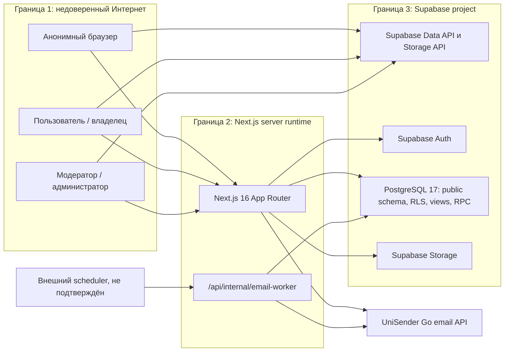

# AL-AMIN / «Аманат»: baseline безопасности

Дата среза: **2026-08-09**  
Этап: **1 — read-only аудит и план**  
Вердикт среза: **BLOCKED**  
Область: код, локальные SQL-миграции, зависимости, тесты, документация и доступные read-only метаданные подключённого Supabase-проекта `amanat`.

## 1. Назначение и границы уверенности

Этот документ фиксирует фактически обнаруженную архитектуру и исходную точку для постоянного security-workstream. Это не сертификат безопасности и не pentest production. Отсутствие находки не означает отсутствие уязвимости.

В ходе этапа:

- production-код не исправлялся;
- миграции не применялись;
- remote schema, Auth, Storage, данные, ключи и настройки хостинга не изменялись;
- пользователи и тестовые данные в production не создавались;
- DAST, спам- и нагрузочные атаки не выполнялись;
- секретные значения не выводились в отчёт;
- remote Supabase использовался только для чтения каталога, migration history, advisors, политик, ACL, функций, Storage metadata и последних Auth-логов.

В переданном каталоге отсутствует `.git`, поэтому невозможно подтвердить историю, ветку, dirty state, авторство изменений и отсутствие секретов в Git history. Все ссылки на строки относятся к локальному срезу на дату аудита.

## 2. Методология

Baseline опирается на:

- [OWASP ASVS 5.0, Level 2](https://owasp.org/www-project-application-security-verification-standard/);
- [OWASP Top 10:2025](https://owasp.org/Top10/2025/);
- [OWASP Web Security Testing Guide](https://owasp.org/www-project-web-security-testing-guide/);
- [NIST SP 800-218 SSDF](https://csrc.nist.gov/pubs/sp/800/218/final);
- [CISA Secure by Design](https://www.cisa.gov/securebydesign);
- актуальные руководства Supabase по [RLS](https://supabase.com/docs/guides/database/postgres/row-level-security), [Data API](https://supabase.com/docs/guides/database/hardening-data-api), [Next.js SSR Auth](https://supabase.com/docs/guides/auth/server-side/nextjs), [сессиям](https://supabase.com/docs/guides/auth/sessions) и [Storage access control](https://supabase.com/docs/guides/storage/security/access-control).

Применяемые принципы: deny by default, least privilege, defense in depth, явная серверная авторизация, fail closed, безопасные defaults, минимизация персональных данных и проверяемое восстановление.

Маркировка доказательств:

- **подтверждено локально** — проверен код, SQL, конфигурация или артефакт;
- **подтверждено live read-only** — проверен каталог или metadata подключённого Supabase без записи;
- **гипотеза** — правдоподобная причина или exploit path, которую нельзя было безопасно подтвердить на production;
- **не подтверждено** — отсутствует доступное доказательство.

## 3. Карта архитектуры и границ доверия

Ключевой вывод: Next.js не является единственным шлюзом. Браузер имеет anon/authenticated credentials и может обращаться к PostgREST и Storage напрямую. Поэтому UI-ограничения и allowlist серверного route handler не заменяют grants, column privileges, RLS, RPC ACL и Storage policies.

## 4. Технологический стек

| Слой | Обнаружено | Состояние безопасности |
|---|---|---|
| Web | Next.js `16.2.12`, App Router; React `19.2.8`; TypeScript | Production build проходит; централизованные headers заданы |
| Auth/API | `@supabase/ssr 0.12.4`, `@supabase/supabase-js 2.112.0` | Server/browser/public клиенты разделены, но отсутствует Next Proxy/middleware для refresh |
| Database | Supabase PostgreSQL `17.6`; public schema; RLS; views; RPC/trigger functions | RLS включена на live public/storage tables; ACL местами шире необходимого |
| Storage | `avatars` public; `profile-media` private | Путь владельца ограничен политикой, но прямой write обходит серверную модерацию/перекодирование |
| Media | Sharp; серверная перекодировка в WebP | Dimension limit и перекодировка есть; прямой Storage write и pre-buffer DoS остаются |
| Email | UniSender Go; DB outbox; internal worker | Worker защищён shared secret; scheduler/alerts и надёжность постановки не подтверждены |
| Supply chain | pnpm lockfile | Integrity hashes есть; production audit содержит high advisories; runtime/package manager не закреплены |
| CI/CD/hosting | В репозитории не обнаружены | Release gates, provenance, actual headers/TLS/WAF не подтверждены |

## 5. Активы

### 5.1 Высокая ценность

- аккаунты, сессии, refresh tokens и recovery/magic-link flows;
- роли `moderator`/`admin` и полномочия публикации;
- анкеты специалистов, черновики и ревизии;
- заявки, включая контакты, `internal_notes`, `call_at` и историю решений;
- жалобы, отзывы, контакты авторов и evidence/material links;
- verification facts, trust badges и атрибуция проверяющего;
- медиа профиля и связь объекта Storage с утверждённой ревизией;
- email outbox, адреса получателей, ошибки доставки;
- service role, worker secret и provider API key;
- миграции, backup/restore и release provenance.

### 5.2 Цели защиты

- конфиденциальность PII и внутренних moderation fields;
- целостность опубликованных профилей, статусов и verification data;
- доступность публичных форм, Auth, media pipeline и email queue;
- подотчётность административных действий;
- воспроизводимость схемы и восстановление после сбоя.

## 6. Роли и фактические границы полномочий

| Роль | Предполагаемая функция | Фактически подтверждённая граница |
|---|---|---|
| `anon` | Читать только публичный каталог; отправлять ограниченные публичные формы через сервер | Может напрямую `INSERT` в `reviews` и `complaints`; читает четыре public projection views |
| `authenticated` / user A/B | Управлять своей учётной записью; видеть только свои данные | Имеет прямой Data API/Storage доступ в пределах RLS; table grants часто шире бизнес-действий |
| profile owner | Редактировать профиль через revision workflow; читать безопасную часть своей заявки | Может напрямую менять/удалять объекты под `submissions/<uid>/`, включая путь опубликованного media; owner SELECT заявки не ограничен по колонкам |
| moderator | Проверять заявки, ревизии, жалобы, отзывы, verification data | `requireModerator()` проверяет user + DB membership; live authenticated UPDATE grants и широкие policies допускают прямое изменение защищённых колонок |
| admin | Управлять ролями и разрушительными административными действиями | В коде существуют отдельные admin checks/actions; прямой moderator path частично обходит эту вертикальную границу |
| service backend | Выполнять server-only записи, публикацию, email queue, cleanup | Service role изолирован серверным модулем; его bypass RLS делает allowlist и атомарность server code обязательными |

Не обнаружено использование изменяемого `user_metadata` для авторизации. Роли хранятся в database tables/helpers, что является положительным контролем. JWT freshness, принудительный AAL2 и session revocation end-to-end не подтверждены.

## 7. Auth и управление сессиями

Подтверждено локально:

- signup/login/reset/magic-link/callback реализованы отдельными маршрутами/actions;
- server-side authorization использует `getUser()`, а не доверяет только локальному `getSession()`;
- redirect/origin helpers ограничивают внешние переходы; bind-only hosts блокируются в production;
- service-role client импортируется из `server-only` модуля;
- секреты не найдены в клиентском source/build exact-value scan.

Подтверждённые пробелы:

- отсутствуют `middleware.ts` и `proxy.ts` для централизованного обновления Supabase cookies;
- `src/lib/supabase/server.ts:11-26` подавляет ошибку записи cookies в Server Components и предполагает наличие Proxy, которого нет;
- ни `requireModerator()`, ни privileged RPC/policies не проверяют AAL2;
- leaked-password protection отмечена live Security Advisor как disabled;
- production canonical URL допускает `http://` при конфигурационной ошибке (`src/lib/navigation.ts:35-43`).

В возвращённой read-only выборке 100 последних Auth-log entries внутри доступного 24-часового периода не было `refresh_token_already_used`, `Possible abuse` или rate-limit событий. Эта ограниченная выборка не доказывает отсутствие событий во всём периоде. Ранее сообщённые 75 событий не удалось независимо подтвердить. Причина «несколько клиентов/вкладки/отсутствующий Proxy» остаётся **гипотезой**, но отсутствующий обязательный SSR control — подтверждённый факт.

Не подтверждены dashboard-параметры signup, password strength, CAPTCHA, redirect allowlist, session lifetime, single-session policy, MFA enrollment, SMTP abuse protection и фактическое удаление/отзыв всех сессий.

## 8. Database, RLS, grants, views и RPC

### 8.1 Подтверждённые защиты

- RLS включена на всех обнаруженных live таблицах `public` и `storage`.
- Owner policies в основном связывают строки с `(select auth.uid()) = owner_id` или owner path.
- Четыре public views публикуют узкие проекции и фильтруют только опубликованные/активные сущности; прямой утечки приватных contact/moderation fields в текущих definitions не найдено.
- Опасные email outbox RPC и новые guard functions отозваны у `PUBLIC`, `anon`, `authenticated`.
- Целевая миграция закрывает прямые записи владельца в `applications` и `specialist_revisions`.

### 8.2 Подтверждённые нарушения границ

- `authenticated` имеет live `SELECT` на `public.applications`; RLS ограничивает строку, но не `internal_notes`, `call_at` и другие колонки владельца.
- `authenticated` имеет live `UPDATE` собственной строки `public.account_profiles`, включая mirrored `email`, хотя recorded migration `202607300001` явно удаляет эту policy; email triggers используют это значение как recipient. Это подтверждённый live schema drift вне целевой migration.
- `anon` и `authenticated` имеют live `INSERT` на `public.reviews` и `public.complaints` вместе с разрешающими policies.
- `authenticated` имеет live `UPDATE` на `public.specialists` и `public.verifications`; moderator policies не дают column-level boundary.
- четыре PostgreSQL-owned views имеют `security_invoker=false`, `security_barrier=true` и дают `SELECT` anon/authenticated; Security Advisor сообщает четыре ERROR.
- live default ACL автоматически выдаёт будущим таблицам широкие права, а будущим функциям — `EXECUTE` для API-ролей. Это не соответствует opt-in/least privilege.
- 10 SECURITY DEFINER functions доступны `anon`, 11 — `authenticated`; прямой exploit большинства не доказан, но surface избыточен.
- восемь функций имеют mutable `search_path`; чувствительные SECURITY DEFINER, изученные отдельно, в основном фиксируют path, а две функции целевой миграции используют `pg_catalog, public`.
- прямые table grants в целом шире, чем необходимые операции; безопасность слишком зависит от корректности каждой RLS policy.

Performance Advisor также сообщает неиндексированные foreign keys, повторную инициализацию `auth.*` expressions и multiple permissive policies. Это прежде всего риск деградации/DoS и сложность доказательства policy semantics.

## 9. Целевая миграция 20260809001646

Файл: `supabase/migrations/20260809001646_enforce_server_only_specialist_writes.sql`.

### 9.1 Проверка артефакта

- файл существует;
- локальный SHA-256 **точно совпадает** с ожидаемым: `5E79860BA9D020F434EA704A69B31F3021EA0EC7A7A8CA672F50540681D142FD`;
- более поздних локальных миграций нет;
- migration history live содержит версию `20260809001646`;
- 17 сохранённых live statements после нормализации точно совпадают с локальным файлом;
- live grants, policies, trigger functions и triggers эквивалентны миграции.

### 9.2 Что меняет миграция

- отзывает `INSERT/UPDATE/DELETE` у `PUBLIC`, `anon`, `authenticated` для `applications` и `specialist_revisions`;
- удаляет старые owner/anonymous write policies, оставляя owner SELECT заявки;
- заменяет application content guard на contract v2: новые/контентно изменённые записи должны быть v2, а legacy v1 разрешено только status-only модерировать;
- добавляет эквивалентную проверку payload ревизии;
- отзывает прямой `EXECUTE` guard functions у недоверенных ролей;
- пересоздаёт triggers.

### 9.3 Безопасность, ограничения и восстановление

Миграция не переписывает данные и не выполняет destructive table DDL. `CREATE TRIGGER` требует краткий lock, поэтому плановый deploy всё равно должен иметь preflight и наблюдение. Её следует разворачивать только совместно с готовыми server-only handlers.

Ограничения:

- owner SELECT заявки намеренно сохранён и создаёт отдельную column-confidentiality проблему;
- trigger не защищает `owner_id`; корректность server-only write зависит от server authorization/allowlist;
- service-role event writes дают `auth.uid() = NULL`, что ухудшает атрибуцию audit trail;
- rollback script в migration history отсутствует.

Предпочтителен **forward-fix**. Если откат неизбежен, новая миграция должна восстановить только заранее сохранённые точные grants/policies и только после отката зависимого server code. Нельзя выдавать generic/anonymous DML или ослаблять RLS.

## 10. Storage и обработка файлов

Live состояние:

| Bucket | Public | Ограничения | Наблюдение |
|---|---:|---|---|
| `avatars` | да | 2 MB; JPEG/PNG/WebP | Legacy/public bucket; на момент среза пуст |
| `profile-media` | нет | 5 MB; JPEG/PNG/WebP | Используется; objects защищены owner-path policies |

Подтверждённые защиты:

- `/api/media` требует authenticated user, проверяет Origin, тип и заявленный размер;
- Sharp задаёт лимит пикселей и перекодирует изображение в WebP, что удаляет исходный SVG/EXIF и снижает MIME-spoofing риск;
- `/api/media/view` и `/api/media/source` заново авторизуют owner/moderator/public access и отдают перекодированный output;
- profile-media private; owner paths имеют форму `submissions/<auth.uid()>/...`.

Подтверждённые пробелы:

- live `authenticated` имеет `INSERT/UPDATE/DELETE` на `storage.objects`, а policy разрешает владельцу операции во всём собственном префиксе;
- direct Storage API обходит `/api/media`, позволяет заменить или удалить объект по уже опубликованному пути и загрузить orphan objects; это нарушает integrity moderation workflow;
- `/api/media` сначала выполняет `request.formData()`, а затем проверяет размер: application-level защита не предотвращает буферизацию большого тела;
- `src/lib/media-cleanup.ts:17-31` при ошибке reference query продолжает service-role delete (fail open) и учитывает только `pending`, хотя `changes_requested` остаётся активным состоянием.

Signed URLs в текущем публичном media flow не являются основной границей: доступ реализован через авторизующий server route. Квоты на число объектов, durable upload rate limit, malware scanning и гарантированная garbage collection не подтверждены.

## 11. Маршруты и входные точки

### 11.1 Публичные страницы

- главная, каталог и публичная карточка специалиста;
- about, rules, privacy, support, verification;
- login, register, resend confirmation, forgot/reset password;
- apply и публичные формы feedback.

React по умолчанию экранирует текст. `dangerouslySetInnerHTML` не найден. User-controlled backend fetch/SSRF sink и raw SQL interpolation из пользовательского ввода не найдены; database access использует Supabase query builder/RPC. Это static observation, а не выполненный SQL injection/SSRF test. URL validators в основном требуют HTTPS; production origin helper всё ещё принимает HTTP.

### 11.2 Server/API routes

| Маршрут | Назначение | Основные controls | Основные пробелы |
|---|---|---|---|
| `/api/applications` | подача заявки | auth, Origin, schema validation, server-only DB write | body буферизуется до auth/size; process-local limiter; race/нет DB idempotency |
| `/api/reviews` | публичный отзыв | route validation | direct Data API bypass; нет durable throttling/CAPTCHA/idempotency/body cap |
| `/api/complaints` | публичная жалоба | route validation | direct Data API bypass; protected fields доступны через table INSERT; нет abuse controls |
| `/api/media` | upload/normalize media | auth, Origin, MIME/size/pixel checks, WebP re-encode | direct Storage bypass; parse-before-limit |
| `/api/media/view`, `/source` | контролируемая выдача | ownership/moderator/public checks; re-encode | dynamic hostile-file tests не запускались |
| `/api/internal/email-worker` | отправка outbox | shared worker secret, server client | scheduler, structured logs и alerts не подтверждены |
| `/api/admin/session` | privileged session response | moderator check/no-store intent | AAL2 отсутствует; deployed headers не проверены |
| `/auth/callback` | OAuth/PKCE/magic-link callback | redirect helper | multi-tab/session refresh behavior не проверено end-to-end |

### 11.3 Server Actions

`cabinet/actions.ts` обслуживает revision workflow владельца; `admin/actions.ts` — moderation/publication/deletion/role-related operations. Server-side checks присутствуют, но service-role bypass RLS и широкие live grants требуют отдельной проверки каждого action и исключения прямого PostgREST обхода.

## 12. HTTP, браузерная поверхность и ошибки

Подтверждено в `next.config.mjs`:

- Content-Security-Policy;
- `X-Content-Type-Options: nosniff`;
- `Referrer-Policy` и `Permissions-Policy`;
- anti-framing (`frame-ancestors 'none'`, `X-Frame-Options: DENY`);
- COOP;
- HSTS для production;
- `poweredByHeader: false`;
- `no-store` для private/API paths.

Residual risk: CSP разрешает inline scripts/styles. В текущем build нет production client maps под `.next/static`, но server maps существуют и их недоступность извне зависит от deploy; exact server secrets в artefact не найдены. Реальные production headers, CORS, CDN caching, TLS redirect, source-map exposure, WAF и reverse-proxy body limits не проверены. В коде не найдено явного verbose secret error output, но локальные логи содержат неотредактированные `code=` query parameters.

## 13. Зависимости и supply chain

Подтверждено:

- lockfile согласован с manifest; 438 package records имеют integrity hash;
- нет Git/tarball/local dependencies и root lifecycle hooks;
- `package.json` помечен private;
- production dependency audit: **4 High, 2 Moderate**;
- full dependency audit: **8 High, 2 Moderate**;
- production paths включают уязвимые `sharp 0.34.5`, `postcss 8.4.31`, `nanoid 3.3.16`;
- десять direct dependencies заданы как `latest`;
- Node/pnpm не закреплены, `packageManager` отсутствует;
- `pnpm-workspace.yaml` содержит placeholder-значения для build hooks `sharp` и `unrs-resolver` вместо явного решения.

Локально установленный direct `sharp 0.35.3` исправлен, но Next dependency graph всё ещё разрешает `0.34.5`. Exploitability части PostCSS/nanoid advisories зависит от attacker-controlled build input; это не отменяет failing production audit gate.

## 14. CI/CD, окружения, секреты и операции

Не обнаружены `.github`, иной CI manifest, CODEOWNERS, Dependabot/Renovate, SBOM, container/hosting IaC, runtime pin, release signing или environment promotion policy. Поэтому GitHub Actions permissions, pinning сторонних actions и защита CI secrets не могут быть проверены. В переданном каталоге нет `supabase/config.toml`.

`.env.local` содержит непустые реальные server secrets, но `.gitignore` корректно исключает env/log/key/dump patterns. Exact-value scan не нашёл эти серверные секреты в source/build; публичный anon key ожидаемо присутствует в browser bundle. Из-за отсутствия Git metadata невозможно проверить history/tracking.

`outputs/` и `*.tsbuildinfo` не исключены. Локальные отчёты содержат recipient/auth metadata, а dev log — `code=` query parameters. Remote E2E scripts читают `.env.local` и могут создать users/data в любом указанном проекте без test-project allowlist и явного opt-in; они не запускались.

Backup/restore, Storage copy, RPO/RTO и restore rehearsal описаны только как намерение в `SECURITY_OPERATIONS.md`; доказательств выполнения нет. Supabase DB backup сам по себе не является копией объектов Storage. Политика retention/purge и полноценный incident-response playbook отсутствуют.

## 15. Подтверждённые controls

- RLS на всех обнаруженных live public/storage tables.
- Точная и live-эквивалентная целевая server-only migration.
- Server-only изоляция service role; exact-value leak в client bundle не обнаружен.
- Узкие public view projections без найденной текущей утечки приватных полей.
- Owner path checks в private Storage и server-side media read authorization.
- WebP re-encoding и pixel limits в media routes.
- `getUser()` для server authorization; отсутствие auth по `user_metadata`.
- Сильный базовый набор HTTP headers в source configuration.
- React escaping; отсутствие `dangerouslySetInnerHTML` и найденного SSRF sink.
- Lockfile integrity; локальные tests/typecheck/build проходят.

Эти controls важны, но не компенсируют подтверждённые bypass paths.

## 16. Неподтверждённые области

- Git history, branch, code review и clean release provenance;
- fresh-environment migration replay и catalog equivalence;
- фактические production headers, TLS, CDN cache, CORS, WAF и request-size limits;
- Auth dashboard: CAPTCHA, password policy, MFA enrollment, redirect allowlist, session lifetime/revocation;
- dynamic cross-user/BOLA, direct REST mutation и hostile upload tests — намеренно не запускались на production;
- Edge/CDN/DDoS limits и durable rate limiting;
- scheduler, delivery SLO, monitoring, alerting и on-call;
- backups Storage/DB/config и успешный restore rehearsal;
- data retention/deletion workflow и incident response;
- DNS/DMARC live state (имеется только прошлый snapshot с `p=none`);
- deployment environment separation и secret rotation evidence.

## 17. Локальная проверка baseline

- `node --test tests/*.test.mjs`: **85/85 PASS**;
- TypeScript `--noEmit`: **PASS**;
- ESLint: **PASS с 12 warnings**;
- production Next build: **PASS**;
- production dependency audit: **FAIL — 4 High, 2 Moderate**;
- full dependency audit: **FAIL — 8 High, 2 Moderate**;
- Git status/log: **NOT AVAILABLE — каталог не является Git worktree**;
- Supabase Security Advisor: **34 notices**, включая 4 ERROR views, broad function execution/default ACL, mutable search paths и disabled leaked-password protection;
- Supabase Performance Advisor: **33 notices**.

Детальные риски и критерии исправления находятся в `SECURITY_FINDINGS.md`, тесты — в `SECURITY_TEST_MATRIX.md`, последовательность работ — в `SECURITY_ROADMAP.md`.
